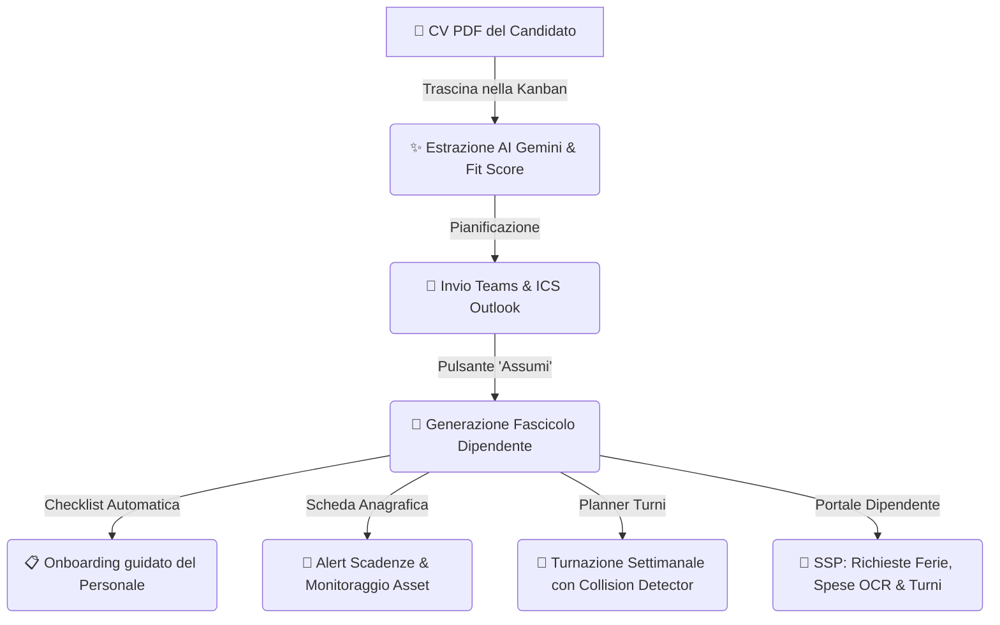
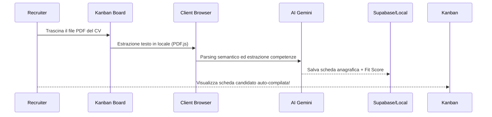

# 📖 Manuale Operativo & Visuale: Todos Hub

Benvenuto nella guida visuale e operativa completa di **Todos Hub**, la piattaforma integrata all'avanguardia per la gestione strategica delle Risorse Umane (HRIS) e l'acquisizione dei talenti (ATS) firmata **Todos.it** (*born to be wireless*).

Questo manuale è progettato per illustrare visivamente tutti gli 8 moduli avanzati e le potenzialità della piattaforma.

---

## 🗺️ Visual Journey: Il Flusso Digitale del Personale

Il diagramma seguente mostra il percorso completo compiuto da una risorsa all'interno del sistema:



---

## 🛠️ Guida Dettagliata delle Funzionalità (Tutti gli 8 Moduli)

---

### 1. 📋 ATS Kanban Board & AI CV Parser (Fase 1)
La gestione del recruiting avviene nel tab **Ricerche Attive**. Cliccando su una ricerca si accede alla Kanban board interattiva.



> [!NOTE]
> Il drag and drop dei curricula in PDF elabora i testi direttamente sul client del browser tramite `PDF.js` e compila le anagrafiche in tempo reale, garantendo il massimo rispetto della privacy.

* **Fit Match AI:** Cliccando sul candidato, viene mostrato il **Fit Score (0-100%)** con l'analisi di adeguatezza al ruolo, punti di forza, punti di debolezza e una lista di **domande personalizzate** generate da Gemini da porre al colloquio.

---

### 2. 📅 Appuntamenti, Colloqui & Outlook Integration (Fase 2)
All'interno del dettaglio candidato, la sezione **Pianifica Colloquio** consente di impostare data, ora, intervistatore e note.

> [!TIP]
> **Il File ICS Automatico:** All'invio del colloquio, la piattaforma scarica in automatico un file di calendario `.ics` compatibile con Outlook/Apple Calendar, contenente le note e il link Teams simulato per sincronizzare i calendari di candidati e recruiter in modo sicuro.

---

### 3. 📋 Checklist di Onboarding & Offboarding (Fase 2)
Quando promuovi un candidato a **Assunto** (`Assunto`), compare un banner verde luminoso che ti consente di inserire la risorsa tra i Dipendenti in un solo clic.
* **Auto-Checklist:** Il sistema assegna automaticamente una checklist standard di **6 compiti di onboarding** (amministrativi, IT, di formazione).
* **Barra di Avanzamento:** L'HR può monitorare la percentuale di completamento complessiva e registrare compiti ad-hoc.

---

### 4. 📈 Valutazione Performance con Radar Chart SVG (Fase 2)
All'interno del dettaglio dipendente, nel pannello **Performance & OKR**, è integrata una piattaforma di monitoraggio continuo degli obiettivi.
* **Radar Competenziale Custom:** Un grafico a ragnatela generato in **SVG nativo** confronta visivamente l'**Autovalutazione del Dipendente** (Area Azzurra) con la **Valutazione del Manager** (Area Rossa Todos `#d90429`) su 4 macro-competenze chiave (Tech, Teamwork, Proactivity, Communication).
* **OKR Interattivi:** Slider orizzontali trascinabili per aggiornare la percentuale di avanzamento dei Key Results aziendali e personali.

---

### 5. 💼 Note Spese Smart & AI OCR Scanner (Fase 3)
La gestione contabile dei rimborsi si centralizza nel tab **Note Spese**.
* **Scanner Laser AI OCR (Simulato):** Scegliendo uno dei tre modelli di scontrini precaricati (*Cena di lavoro*, *Treno Frecciarossa*, *Soggiorno Hotel*), si avvia un'animazione premium con un raggio laser verde fluorescente oscillante (`@keyframes scan`). Dopo 2 secondi, l'AI estrae esercente, importo, categoria e note compilando il form all'istante.
* **Esportazione CSV:** Generazione e download istantaneo del file CSV formattato per la contabilità generale dell'azienda.

---

### 6. 🏢 Organigramma Aziendale Dinamico & Rubrica (Fase 6)
Nel tab **👥 Dipendenti**, un comodo selettore consente di passare dalla visualizzazione classica a griglia a quella dell'**Organigramma Dinamico**.
* **Grafo Gerarchico Interattivo:** Mostra le relazioni di riporto gerarchico (CEO -> Tech / Sales) con box sagomati collegati da rami grafici.
* **Rubrica Integrata:** Cliccando sul dipendente nell'organigramma, la vista si chiude automaticamente scorrendo la pagina e focalizzando/evidenziando la scheda anagrafica dettagliata di quella risorsa!

---

### 7. 🔑 Portale Self-Service Dipendente - SSP (Fase 4 & Sync 8)
La suite isola le sessioni utente in base al ruolo. Selezionando un dipendente dal menu di login (es. Mario Rossi, Laura Bianchi, Alessandro Neri), l'app nasconde i menu dedicati ai recruiter e apre un'**area riservata esclusiva per la risorsa (SSP)**.
* **Il mio Fascicolo:** Il lavoratore consulta RAL, data assunzione, beni assegnati (MacBook, iPhone con codici seriali) e il proprio stato di adempimenti medici/sicurezza.
* **Richieste & Spese:** Il dipendente invia ferie o scansiona scontrini in totale autonomia.
* **I Miei Turni (Novità):** Un elenco cronologico completo dei turni pianificati per lui, con l'evidenziazione luminosa rossa e badge animato per il turno di **OGGI**.

---

### 8. ⚡ Motore di Automazioni & Notifiche (Fase 7)
Un vigile guardiano posizionato nell'Header di sistema (Campana Notifiche con badge contatore pulsante).
* **Generatore Dinamico di Scadenze:** Ad ogni avvio, il motore confronta la data corrente con i dati nel database e genera allarmi automatici:
  * **Alert Expiry (Arancione/Rosso):** Se il documento d'identità, il corso di sicurezza o la visita medica di un dipendente scade entro 30 giorni (o è già scaduto), o se il periodo di prova è vicino al termine.
  * **Alert Flussi (Blu/Verde):** Segnala rimborsi spese o richieste ferie pendenti da approvare.
* **Silenziamento Rapido:** Cliccando su `×`, l'utente rimuove o silenzia la notifica all'istante.

---

### 9. 📅 Planner Grafico dei Turni - Weekly Scheduler (Fase 8)
Il tab **📅 Planner Turni** centralizza la pianificazione organizzativa oraria settimanale dei dipendenti.
* **Griglia Oraria:** Visualizza i dipendenti sulle righe e i giorni della settimana (Lunedì - Domenica) sulle colonne.
* **Collision Detector Ferie:** Se un dipendente ha delle ferie approvate/pendenti in un giorno, la cella corrispondente mostra il badge `🏝️ FERIE`. Se viene programmato un turno in quella data, il sistema evidenzia il badge del turno con un bordo rosso brillante ed emette un prompt di sicurezza.
* **Overtime Alert:** Calcola in tempo reale la somma oraria settimanale per risorsa. Se supera le 40 ore contrattuali, mostra un badge rosso di sforamento (`⚠️ 42h`).

---

## 🗂️ Mappa dei Dati di Esempio Demo Precaricati

| Dipendente | Ruolo | Reparto | Scenario Demo / Alert Attivi / Turnazione |
| :--- | :--- | :--- | :--- |
| **Mario Rossi** | Senior Frontend Developer | Tech | **Ferie Approvate** nella settimana corrente. MacBook Pro + iPhone assegnati. Turnazione: Mattina (08:00 - 16:00). |
| **Laura Bianchi** | Account Executive | Commerciale | **Richiesta Permesso Pendente** attiva. **Alert Giallo:** Corso sicurezza in scadenza tra meno di 30 giorni. Turnazione: Pomeriggio (14:00 - 22:00). |
| **Alessandro Neri** | HR Manager | HR / Recruiting | **Ferie Approvate**. **Alert Rosso:** Visita medica di idoneità scaduta. Turnazione: Notte (22:00 - 06:00). |
| **Sofia Gialli** | Responsabile Contabile | Amministrazione | Contratto a termine. **Alert Giallo:** Scadenza periodo di prova imminente. Turnazione: Turni Custom. |
| **Valerio Verdi** | Junior Developer | Tech | Neo-assunto. **Alert Giallo Doppio:** Corso sicurezza e visita medica entrambi da rinnovare a breve. Turnazione: Pomeriggio. |

---

## 🗄️ 11. Script SQL delle Migrazioni (Supabase SQL Editor)

Se riscontri errori di database come `invalid input syntax for type uuid` o tabelle mancanti durante il popolamento, significa che non hai configurato le tabelle Supabase con lo schema corretto.

Copia il seguente script SQL ed eseguilo integralmente nel pannello **SQL Editor** del tuo database Supabase:

```sql
-- 1. TABELLA POSIZIONI (06app_Noi_jobs)
CREATE TABLE IF NOT EXISTS "06app_Noi_jobs" (
  id UUID DEFAULT gen_random_uuid() PRIMARY KEY,
  title TEXT NOT NULL,
  department TEXT NOT NULL,
  status TEXT DEFAULT 'Open' NOT NULL,
  description TEXT NOT NULL,
  requirements TEXT,
  created_at TIMESTAMP WITH TIME ZONE DEFAULT TIMEZONE('utc'::text, NOW()) NOT NULL
);

-- 2. TABELLA CANDIDATI (06app_Noi_candidates)
CREATE TABLE IF NOT EXISTS "06app_Noi_candidates" (
  id UUID DEFAULT gen_random_uuid() PRIMARY KEY,
  job_id UUID REFERENCES "06app_Noi_jobs"(id) ON DELETE CASCADE,
  name TEXT NOT NULL,
  email TEXT,
  phone TEXT,
  stage TEXT DEFAULT 'Nuovi CV' NOT NULL,
  cv_text TEXT,
  competenze JSONB DEFAULT '[]'::jsonb,
  esperienze JSONB DEFAULT '[]'::jsonb,
  istruzione JSONB DEFAULT '[]'::jsonb,
  fit_score INTEGER DEFAULT 0,
  match_analysis JSONB DEFAULT '{}'::jsonb,
  stato_interazione TEXT DEFAULT 'Da contattare',
  cv_url TEXT DEFAULT '',
  data_colloquio_1 TIMESTAMP WITH TIME ZONE,
  data_colloquio_2 TIMESTAMP WITH TIME ZONE,
  data_chiamata TIMESTAMP WITH TIME ZONE,
  created_at TIMESTAMP WITH TIME ZONE DEFAULT TIMEZONE('utc'::text, NOW()) NOT NULL
);

-- 3. TABELLA NOTE CANDIDATO (06app_Noi_notes)
CREATE TABLE IF NOT EXISTS "06app_Noi_notes" (
  id UUID DEFAULT gen_random_uuid() PRIMARY KEY,
  candidate_id UUID REFERENCES "06app_Noi_candidates"(id) ON DELETE CASCADE,
  author_email TEXT NOT NULL,
  content TEXT NOT NULL,
  created_at TIMESTAMP WITH TIME ZONE DEFAULT TIMEZONE('utc'::text, NOW()) NOT NULL
);

-- 4. TABELLA APPUNTAMENTI (06app_Noi_appointments)
CREATE TABLE IF NOT EXISTS "06app_Noi_appointments" (
  id UUID DEFAULT gen_random_uuid() PRIMARY KEY,
  candidate_id UUID REFERENCES "06app_Noi_candidates"(id) ON DELETE CASCADE,
  candidate_name TEXT NOT NULL,
  job_title TEXT NOT NULL,
  interviewer_email TEXT NOT NULL,
  date_time TIMESTAMP WITH TIME ZONE NOT NULL,
  meeting_type TEXT DEFAULT 'Teams' NOT NULL,
  meeting_link TEXT,
  notes TEXT,
  created_at TIMESTAMP WITH TIME ZONE DEFAULT TIMEZONE('utc'::text, NOW()) NOT NULL
);

-- 5. TABELLA TEMPLATE POSIZIONI (06app_Noi_job_templates)
CREATE TABLE IF NOT EXISTS "06app_Noi_job_templates" (
  id UUID DEFAULT gen_random_uuid() PRIMARY KEY,
  title TEXT NOT NULL,
  department TEXT NOT NULL,
  description TEXT NOT NULL,
  requirements TEXT,
  created_at TIMESTAMP WITH TIME ZONE DEFAULT TIMEZONE('utc'::text, NOW()) NOT NULL
);

-- 6. TABELLA DIPENDENTI (06app_Noi_employees)
CREATE TABLE IF NOT EXISTS "06app_Noi_employees" (
  id UUID PRIMARY KEY DEFAULT gen_random_uuid(),
  candidate_id UUID REFERENCES "06app_Noi_candidates"(id) ON DELETE SET NULL,
  name TEXT NOT NULL,
  email TEXT NOT NULL UNIQUE,
  phone TEXT,
  department TEXT NOT NULL,
  role TEXT NOT NULL,
  hire_date DATE NOT NULL DEFAULT CURRENT_DATE,
  contract_type TEXT NOT NULL,
  ral NUMERIC DEFAULT 0,
  trial_period_end DATE,
  assets JSONB DEFAULT '[]'::jsonb,
  document_id_expiry DATE,
  safety_course_expiry DATE,
  medical_visit_expiry DATE,
  created_at TIMESTAMPTZ DEFAULT NOW()
);

-- 7. TABELLA FERIE/ASSENZE (06app_Noi_leaves)
CREATE TABLE IF NOT EXISTS "06app_Noi_leaves" (
  id UUID PRIMARY KEY DEFAULT gen_random_uuid(),
  employee_id UUID REFERENCES "06app_Noi_employees"(id) ON DELETE CASCADE,
  employee_name TEXT NOT NULL,
  type TEXT NOT NULL,
  start_date DATE NOT NULL,
  end_date DATE NOT NULL,
  hours NUMERIC,
  status TEXT NOT NULL DEFAULT 'Pending',
  notes TEXT,
  created_at TIMESTAMPTZ DEFAULT NOW()
);

-- 8. TABELLA CHECKLISTS (06app_Noi_checklists)
CREATE TABLE IF NOT EXISTS "06app_Noi_checklists" (
  id UUID PRIMARY KEY DEFAULT gen_random_uuid(),
  employee_id UUID REFERENCES "06app_Noi_employees"(id) ON DELETE CASCADE,
  employee_name TEXT NOT NULL,
  type TEXT NOT NULL,
  task_name TEXT NOT NULL,
  assigned_to TEXT NOT NULL,
  is_completed BOOLEAN NOT NULL DEFAULT FALSE,
  completed_at TIMESTAMPTZ,
  created_at TIMESTAMPTZ DEFAULT NOW()
);

-- 9. TABELLA PERFORMANCE (06app_Noi_performances)
CREATE TABLE IF NOT EXISTS "06app_Noi_performances" (
  id UUID PRIMARY KEY DEFAULT gen_random_uuid(),
  employee_id UUID REFERENCES "06app_Noi_employees"(id) ON DELETE CASCADE,
  employee_name TEXT NOT NULL,
  review_period TEXT NOT NULL,
  self_rating JSONB NOT NULL,
  manager_rating JSONB NOT NULL,
  overall_feedback TEXT,
  okrs JSONB DEFAULT '[]'::jsonb,
  created_at TIMESTAMPTZ DEFAULT NOW()
);

-- 10. TABELLA NOTE SPESE (06app_Noi_expenses)
CREATE TABLE IF NOT EXISTS "06app_Noi_expenses" (
  id UUID PRIMARY KEY DEFAULT gen_random_uuid(),
  employee_id UUID REFERENCES "06app_Noi_employees"(id) ON DELETE CASCADE,
  employee_name TEXT NOT NULL,
  expense_date DATE NOT NULL DEFAULT CURRENT_DATE,
  merchant TEXT NOT NULL,
  amount NUMERIC NOT NULL DEFAULT 0,
  category TEXT NOT NULL,
  receipt_name TEXT,
  status TEXT NOT NULL DEFAULT 'Pending',
  notes TEXT,
  created_at TIMESTAMPTZ DEFAULT NOW()
);

-- 11. TABELLA TURNI (06app_Noi_shifts)
CREATE TABLE IF NOT EXISTS "06app_Noi_shifts" (
  id UUID PRIMARY KEY DEFAULT gen_random_uuid(),
  employee_id UUID REFERENCES "06app_Noi_employees"(id) ON DELETE CASCADE,
  employee_name TEXT NOT NULL,
  shift_date DATE NOT NULL,
  start_time TIME NOT NULL,
  end_time TIME NOT NULL,
  shift_type TEXT NOT NULL,
  notes TEXT,
  created_at TIMESTAMPTZ DEFAULT NOW()
);
```
